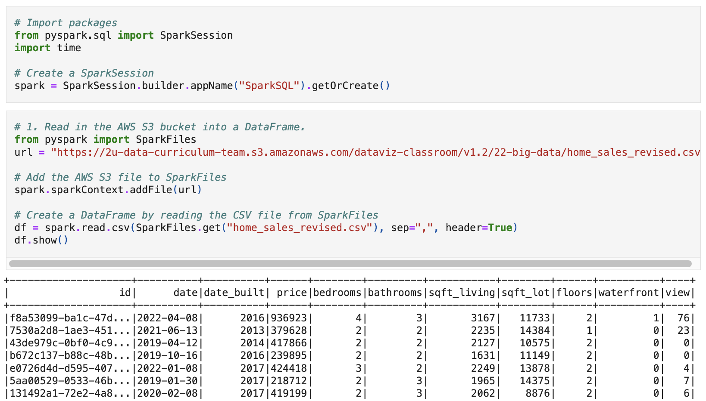
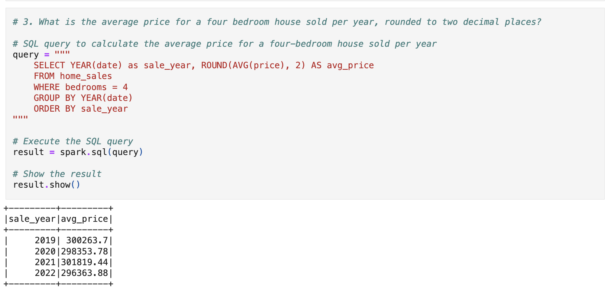

# home-sales-challenge
Home Sales Data Analysis with SparkSQL

## Contents

1. [Overview](#1-overview)
2. [Repository](#2-repository)
3. [Deployment](#3-deployment)
4. [Resources](#4-resources)

## 1. Overview
This challenge uses SparkSQL to determine key metrics about home sales data. Spark will be used to create temporary views, partition the data, cache and uncache a temporary table, and verify that the table has been uncached.

## 2. Repository

Jupyter Notebooks
- [`Home_Sales.ipynb`](Home_Sales.ipynb)

## 3. Deployment

- Sign in to Google Colab or any online Jupyter Notebook services that support big-data libraries like PySpark. 
- Make sure all required libraries are installed.
- Upload and run the following notebook: [`Home_Sales.ipynb`](Home_Sales.ipynb)

## 4. Resources

Data for the dataset was generated by edX Boot Camps LLC, and is intended for educational purposes only.
